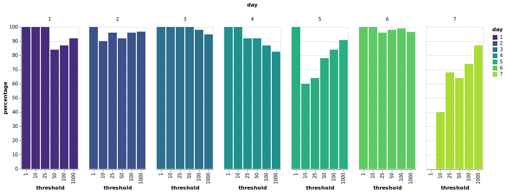

# Word List Establishment

What model does contexto use? How many words are in their dictionary? Having absolutely no knowlege of the dictionary that contexto uses, where should we even begin? If you're anything like me, the first thing you would do is get a list of the most frequent English words, say starting with the first [3000](https://www.ef.edu/english-resources/english-vocabulary/top-3000-words/).

Unfortunately, this word list is wholly insufficient and misses **160** of the first 427 winning words:

```
['banana', 'bee', 'tv', 'pen', 'diamond', 'soda', 'queen', 'christmas', 'trophy', 'comma', 'lamp', 'choir', 'bakery', 'headphone', 'triangle', 'app', 'exam', 'violin', 'lion', 'cabbage', 'eagle', 'scarf', 'milkshake', 'fairy', 'needle', 'frog', 'toothpaste', 'fireman', 'zebra', 'grasshopper', 'cereal', 'calculator', 'strawberry', 'purse', 'lobster', 'butterfly', 'puzzle', 'starfish', 'mushroom', 'eraser', 'pasta', 'symphony', 'treasure', 'mermaid', 'spider', 'gym', 'guitar', 'magnet', 'pumpkin', 'documentary', 'pirate', 'astronaut', 'opera', 'workout', 'octopus', 'shark', 'trailer', 'spoon', 'metro', 'pyramid', 'stamp', 'jelly', 'postcard', 'innovation', 'sausage', 'asteroid', 'iceberg', 'massage', 'salon', 'continent', 'fries', 'molecule', 'valentine', 'soap', 'trash', 'cafeteria', 'hallway', 'grammar', 'toilet', 'stadium', 'elevator', 'goat', 'dishwasher', 'dentist', 'elephant', 'happiness', 'keyboard', 'dolphin', 'rainbow', 'backpack', 'cellphone', 'pillow', 'promotion', 'toothbrush', 'sock', 'microphone', 'candle', 'paintbrush', 'necklace', 'programmer', 'robot', 'parrot', 'kettle', 'perfume', 'sailor', 'volcano', 'wig', 'yogurt', 'mailbox', 'olive', 'drawer', 'pineapple', 'duck', 'castle', 'suitcase', 'flute', 'waffle', 'wardrobe', 'silk', 'giraffe', 'laptop', 'salmon', 'wallet', 'hammer', 'bacteria', 'scarecrow', 'geography', 'cello', 'sibling', 'spinach', 'diaper', 'carpet', 'bow', 'curtain', 'sofa', 'melody', 'cinnamon', 'appliance', 'orchestra', 'vanilla', 'cheddar', 'dollar', 'puppy', 'refrigerator', 'academy', 'prince', 'hockey', 'avenue', 'copper', 'compassion', 'smartphone', 'kangaroo', 'festival', 'constitution', 'lantern', 'marathon', 'yacht', 'chorus', 'kidney', 'grapefruit']
```

In other words, a brute force algorithm using the 3,000 word data set would fail approximately $37.5\%$ of the time.

## Better Word Lists

The next step is to search for better word lists; _naturally_, I turned to the [Natural Language Toolkit](https://www.nltk.org/)'s corpora. In particular, I started with one of the most well-known corpora on the market: [The Brown Corpus](https://www.wikiwand.com/en/Brown_Corpus). This corpus is easily accessible using the `nltk` Python package and provides a solid 49655 unique English words. That seems sufficient for our purposes, right? Right? :speak_no_evil:

Before we begin to collect data (for building a model later), we need to see if our words are even accepted by contexto. For example, if we guess "a" then contexto responds with:
```json
{"error":"This word doesn't count, it's too common"}
```
If we guess "virgin", contexto responds with:
```json
{"error":"This word doesn't count"}
```
and if we guess "[effodientia](https://www.merriam-webster.com/dictionary/Effodientia)", contexto complains:
```json
{"error":"I'm sorry, I don't know this word"}
```
pshhh, idiot.

Thus, in order to actually establish an initial word list, we need to send API requests for every single word in our list to validate if they are accepted by contexto.


## API Requests

A wise man once said:

> Avec un dictionnaire c'est lent mais on peut facilement avoir un cassage brut ou un scrapper avec un one-liner :
>`while read pass ; do w3m -dump "https://api.contexto.me/machado/en/game/425/$pass" | grep distance | awk -F '[:,]' '{print $2;}' ; done <rockyou.txt`

Sending requests from France I can get about 1.63 responses per second.[^1] If we want to validate 49655 words, that would take about 8 and a half hours[^2]. How can we speed things up?

The majority of the time it takes to finish sending 100 responses is actually the time that it takes to wait for each response. We send a request... then wait for the response. We send a request... then wait for the response. Repeat x 98. Wait a minute! Doing nothing for long periods of time? What does that make you think of (insert funny joke here).

### Async Requests

The solution is, of course, to start sending our requests asynchronously. The [grequests](https://github.com/spyoungtech/grequests) library allows us to accomplish just that using a familiar syntax. Sending async requests in chunks of 100[^3], we can rip through 25,000[^4] requests in about 10 minutes

## Word filtering

With an established mechanism for sending out large batches of async requests, we can now proceed to filtering out words that contexto doesn't like. Dropping words that contexto thinks are too common (`WordTooCommon`), words that contexto thinks are too violent (`WordDoesNotCount`), and words that contexto is ignorant of (`WordNotFound`) - I mean who doesn't know what [polygamodioecious](https://sweetgum.nybg.org/science/glossary/glossary-details/?irn=1271) means, amirite?? - the Brown Corpus is reduced to 24,384 accepted words.

24,384 words is decent enought, right?

Seven. It took 7 days until a winning word didn't appear in our list of 24,384. The word? Bike.



The above graph shows the percentage of words appearing in the top _threshold_, by day. For example, Day 1 had 100% of words in the top 25 closest words appear in our Brown corpus. On day 7, however, 0% of the top 1 word(s) and only 40% of the top 10 appeared in our data set.

## More, More, More!

Ok, so maybe using a corpus compiled in 1961 was quite the flub - my b. We repeat the above filtering steps using a larger [data set](https://github.com/dwyl/english-words)[^5] with almost 400k unique words! How many words do you think contexto accepted? Guess.

??? danger "Spoilers!"

    53802.

    This new data set "words_alpha_filtered.txt" covers 425 out of 427 winning words. The missing links? "cellphone" and "smartphone". This can clue is in to the fact that we need to use word lists that use more modern speech. Nevertheless, the contexto dictionary contains at least 80,000 unique words so we are starting to approach something that we can use for data collection.


[^1]: based on a simple test sending 100 requests at 1:18 AM using some crappy student residence wifi

[^2]: $\frac{49655\ \mathrm{requests}}{1.636\ \mathrm{requests/s}} = 30351.4$ seconds $* \frac{1}{3600\ \mathrm{seconds/h}} = 8.43096$ hours

[^3]: If we send too many requests (around 200) in one "chunk" at a time, we end up with network errors that totally screw up our filtering operation. We've found chunks of 50 or 100 to work quite well. By "chunk", I'm referring to the number of requests that we send to the `grequests.map` function in a single pass.

[^4]: Look, do I really have to explain everything?? Contexto's servers have some sort of DDOS protection that will shut down our requests if we send more than ~28000 of them from a single process. I'm sure there are easy ways to get around that functionality but for now we've just opted to send out requests in batches of 25000 (sometimes 26500)

[^5]: We use the `words_alpha.txt` word list from this repository.